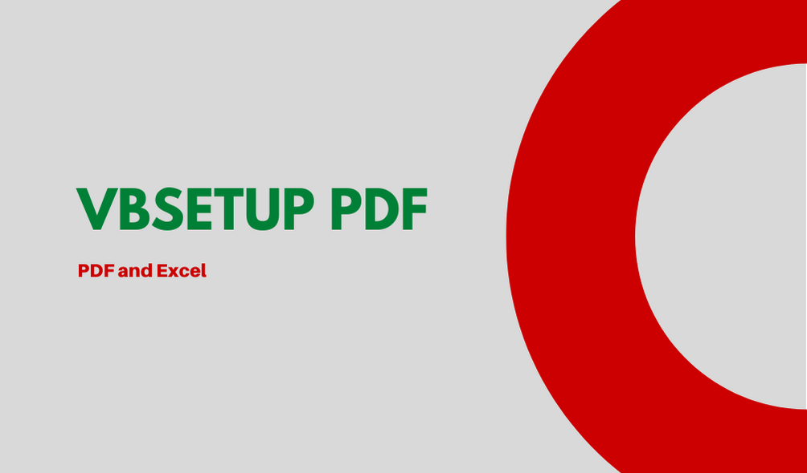
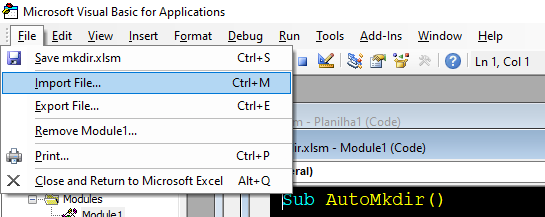

<h3 align="center"> 

</h3>

<h1 align="center">
   📕 <a href="#"> VBSETUP PDF </a>
</h1>

<h3 align="center">
    Script for automatic configuration and export of PDF files from Excel spreadsheets
</h3>

<p align="center">
  
  
  
  
  <a href="https://github.com/vitoriape/vbmkdir/blob/mkdir.vb-vpa/LICENSE">
    
  </a>
  
  <a href="https://github.com/vitoriape/vbmkdir/commits/master">
    
  </a>
</p>

<h4 align="center"> 
	 Status: Finished
</h4>

---
---

Index
=================
<!--ts-->
* [About](#about)
* [Tools](#tools)
* [References](#references)
* [Features](#features)
<!--te-->

## About
This project is an [VBA](https://docs.microsoft.com/pt-br/office/vba/library-reference/concepts/getting-started-with-vba-in-office) script that configure **all worksheets** in the active Excel workbook pages and export them as `PDF` files.

---

## Tools

Development of this script utilizes the tools listed below:

- [Git](https://git-scm.com/)
- [Excel](https://support.microsoft.com/en-us/excel)
- [Visual Basic for Applications](https://docs.microsoft.com/pt-br/office/vba/api/overview/excel)

## References

For more information about using the **object** `PageSetup` and the **method** `Workbook.ExportAsFixedFormat`, read the Microsoft documentation:

- [PageSetup Object](https://docs.microsoft.com/en-us/office/vba/api/excel.pagesetup)
- [Workbook.ExportAsFixedFormat Method](https://docs.microsoft.com/en-us/office/vba/api/excel.workbook.exportasfixedformat)

## Features

- [x] Auto page setup
- [x] Automatic pdf exporter

---

## Pre-requisites

- [Microsoft Excel](https://www.microsoft.com/pt-br/microsoft-365/microsoft-office?ocid=oo_support_mix_marvel_ups_support_smcuhfoffice&rtc=1)
- [Excel Developer Guide Activated](https://support.microsoft.com/en-us/topic/show-the-developer-tab-e1192344-5e56-4d45-931b-e5fd9bea2d45)

---

## Setup
### **Clone this repository:**
```bash
git clone https://github.com/vitoriape/vbsetup-pdf.git
```

>---

### **Open the spreadsheet you want to configure and import the script exportPDF.bas:**



>---

### **Change the commands on the script according to your demands and data format:**


For example, if you want to print a black and white page, change the value of `.BlackAndWhite` for `True`

```vba
.BlackAndWhite = True
```

>---

### **Run the script:**


>---

### **The file will be exported as an xlTypePDF**
Remember, this script works with a **loop statement** and will configure all the workbook. If you need to set a single worksheet, remove the loop:

```vba
Sub PDFLoop()
 With ActiveSheet.PageSetup'#Page Settings
            
                .PaperSize = xlPaperA4                             ' Set papersize = A4 Paper
                .Orientation = xlLandscape                         ' Set orientation = Landscape 
                
                .LeftMargin = Application.InchesToPoints(0.25)     ' Configure margin = Narrow 
                .RightMargin = Application.InchesToPoints(0.25)
                .TopMargin = Application.InchesToPoints(0.75)
                .BottomMargin = Application.InchesToPoints(0.75)
                .HeaderMargin = Application.InchesToPoints(0.3)
                .FooterMargin = Application.InchesToPoints(0.3)
                
                .Zoom = False                                       ' Do not zoom the sheet
                .FitToPagesWide = 1                                 ' Set sheet scale = One page
                .FitToPagesTall = 1
                
                .CenterHorizontally = True                          ' Center sheet horizontally
                .CenterVertically = True                            ' Center sheet vertically 
                
                .PrintHeadings = False                              ' Do not print headings 
                .PrintGridlines = False                             ' Do not print sheet gridlines 
                
                .BlackAndWhite = False                              ' Do not print black and white 
            
    End With
            
        
    Next
    
    
        ActiveWorkbook.ExportAsFixedFormat Type:=xlTypePDF '#Export sheet as PDF file
        
    
    MsgBox "File configured and exported successfully", vbOKOnly, "Console" '#Confirmation message
    Shell "C:\WINDOWS\explorer.exe """ & ActiveWorkbook.Path & "", vbNormalFocus '#Show file location

End Sub
```

---

## Team
### Author
<table>
  <tr>
    <td align="center"><a href="https://github.com/vitoriape"><br /><sub><b>Vitória Peçanha</b></sub></a></td> 
</table>

### License

This project is under the   
<a href="https://github.com/vitoriape/vbsetup-pdf/blob/main/LICENSE">
    
</a>

